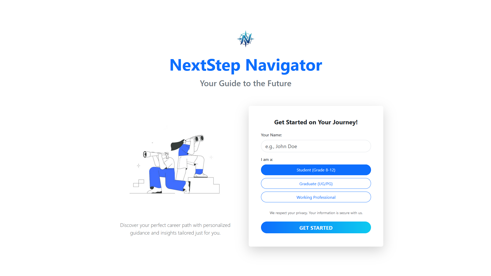
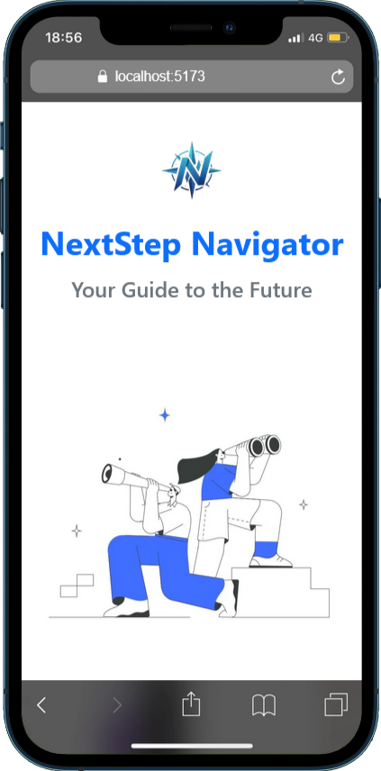

# NextStep Navigator 🌟

A modern, responsive web application built with **React**, **Bootstrap 5**, and **Framer Motion** to guide students, graduates, and professionals through their career development journey.

---

## 📖 Overview

NextStep Navigator is a career guidance platform designed to:

* Help students explore career paths.
* Provide graduates with job and internship resources.
* Support professionals with mentorship and career change tools.

The project includes a clean navigation system, interactive breadcrumbs, and beautifully animated sections with **AOS (Animate On Scroll)** and **Framer Motion**.

---

## 🚀 Features

✅ **Responsive Navigation Bar**
– Left-aligned logo, centered navigation links, and user info on the right.
– Mobile-friendly menu with smooth framer-motion animations.

✅ **Breadcrumb Navigation**
– Clickable, semantic breadcrumbs with a modern chevron divider.
– Responsive and center-aligned on smaller screens.

✅ **About Us Page**
– Mission statement in a modern, gradient card.
– Animated team member section with hover effects.

✅ **Dynamic User Handling**
– Displays username (from `sessionStorage`) in the header.
– Supports multiple user types (student, graduate, professional).

✅ **Smooth Animations**
– Uses `framer-motion` for menu transitions.
– AOS for scroll-triggered animations.

---

## 🛠️ Tech Stack

| Technology        | Usage               |
| ----------------- | ------------------- |
| **React**         | Frontend framework  |
| **Bootstrap 5**   | Layout & components |
| **Framer Motion** | Smooth animations   |
| **AOS**           | Scroll animations   |
| **Lucide-React**  | Icon library        |

---

## 📂 Project Structure

```
src/
│
├── assets/                # Logo & images
├── components/
│   ├── Header.jsx         # Responsive navbar
│   ├── Breadcrumbs.jsx    # Breadcrumb navigation
│   └── Footer.jsx         # Footer component 
│
├── pages/
│   └── AboutUs.jsx        # About Us page
│
├── data/
│   └── menuData.json      # Navigation links for different user types
│
├── styles/
│   ├── Header.css
│   ├── Breadcrumbs.css
│   └── Aboutus.css
│
└── App.jsx                # App entry point with routes
```

---

## ⚙️ Installation & Setup

1. **Clone this repository**

```bash
git clone https://github.com/your-username/nextstep-navigator.git
cd nextstep-navigator
```

2. **Install dependencies**

```bash
npm install
```

3. **Run the development server**

```bash
npm run dev
```

4. Open **[http://localhost:5173/](http://localhost:5173/)** in your browser.

---

## 📸 Screenshots

### 🖥️ Desktop Header



### 📱 Mobile Menu



---

## 🎨 Customization

* **Navigation links** → edit `src/data/menuData.json`.
* **Theme colors** → modify Bootstrap variables or override in your CSS.
* **Team members** → edit the array in `AboutUs.jsx`.

---

## 🧑‍💻 Contributing

Contributions are welcome!
To contribute:

1. Fork the repo
2. Create a new branch (`feature/my-feature`)
3. Commit and push your changes
4. Open a Pull Request

---

## 📄 License

This project is licensed under the **MIT License** – you are free to use, modify, and distribute with attribution.

---

## 🙌 Acknowledgments

* [Bootstrap](https://getbootstrap.com/) for grid system and components
* [Framer Motion](https://www.framer.com/motion/) for smooth animations
* [Lucide Icons](https://lucide.dev/) for clean and modern icons
* [AOS](https://michalsnik.github.io/aos/) for scroll-triggered animations
